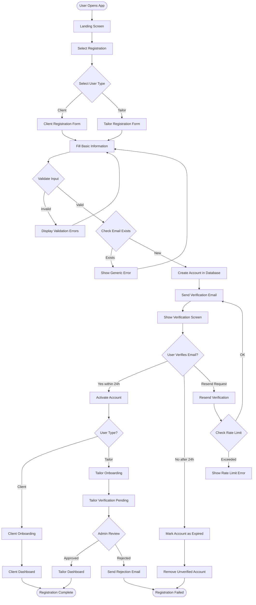

# User Registration Business Flow

## Executive Summary
The user registration journey for Stitch & Wear Tailors accommodates two distinct user types: Clients seeking custom tailoring services and Tailors offering their expertise. The flow emphasizes security, user verification, and appropriate onboarding for each user type.

## Flow Overview



## Detailed Business Rules

### 1. Initial Entry Points
- **Marketing Landing**: Users from marketing campaigns see personalized messaging
- **Referral Entry**: Referenced users see referrer information and potential discounts
- **Direct Access**: Users directly accessing registration see standard flow

### 2. User Type Selection Logic

#### Client Path
- **Immediate Access**: Clients can access basic features immediately after email verification
- **Progressive Profile**: Additional information collected as needed for orders
- **No Admin Approval**: Automated verification sufficient for client accounts

#### Tailor Path
- **Extended Verification**: Requires admin approval after email verification
- **Mandatory Information**: Business license, portfolio, certifications required
- **Quality Control**: Admin reviews portfolio and credentials before approval

### 3. Data Validation Rules

#### Real-time Validation
```
Email Field:
- Check format on blur
- Check domain validity
- Check for disposable emails
- Check for existing account (privacy-safe)

Password Field:
- Minimum 8 characters
- Contains uppercase, lowercase, number, special character
- Not in common password list
- Strength indicator shows in real-time

Name Fields:
- Minimum 2 characters
- No numbers (except for business names)
- Special characters limited to: apostrophe, hyphen, space
```

#### Server-side Validation
```
Pre-Registration Checks:
1. Email uniqueness (return generic error)
2. IP-based rate limiting (5 attempts per hour)
3. Geographic restrictions (if applicable)
4. Blacklist checking (known spam domains)
```

### 4. Email Verification Process

#### Verification Email Logic
```
Email Contents:
- Personalized greeting with user's first name
- Clear call-to-action button
- Verification link valid for 24 hours
- Alternative: 6-digit code for mobile verification
- Support contact for issues

Resend Logic:
- First resend: Immediate
- Second resend: After 5 minutes
- Third resend: After 15 minutes
- Maximum 3 resends per 24 hours
```

### 5. Account States

```
PENDING_VERIFICATION:
- Account created but email not verified
- Cannot log in
- Auto-deleted after 24 hours if not verified

ACTIVE_CLIENT:
- Email verified, client account
- Full access to client features
- Can place orders immediately

PENDING_TAILOR_APPROVAL:
- Email verified, awaiting admin review
- Limited access to profile editing
- Cannot receive orders

ACTIVE_TAILOR:
- Fully approved tailor account
- Can receive and manage orders
- Access to tailor dashboard

SUSPENDED:
- Temporary restriction
- Reason logged in system
- Requires admin intervention

DELETED:
- Soft delete with 30-day recovery
- Data retained for legal compliance
- Cannot reuse email for 90 days
```

### 6. Onboarding Flows

#### Client Onboarding
```
Step 1: Welcome Screen
- Personalized welcome message
- Overview of platform benefits
- Skip option available

Step 2: Style Preferences (Optional)
- Favorite styles selection
- Budget range setting
- Preferred fabrics

Step 3: Measurements (Optional)
- Guide to taking measurements
- Option to save for later
- Professional measurement booking

Step 4: Browse Tailors
- Recommended tailors based on preferences
- Featured collections
- Current promotions
```

#### Tailor Onboarding
```
Step 1: Business Information
- Business name and type
- Years of experience
- Specializations

Step 2: Portfolio Upload
- Minimum 5 work samples
- Categories for organization
- Quality guidelines provided

Step 3: Pricing Setup
- Service categories
- Base pricing
- Turnaround times

Step 4: Availability Setup
- Working hours
- Vacation mode settings
- Order capacity limits

Step 5: Payment Setup
- Bank account verification
- Tax information
- Payout preferences
```

### 7. Error Handling

#### User-Facing Errors
```
Generic Security Error:
"We couldn't create your account. Please check your information and try again."
(Used for: existing email, blocked IP, security violations)

Validation Error:
"[Specific field]: [Specific issue]"
(Used for: format errors, missing required fields)

Rate Limit Error:
"Too many attempts. Please try again in [X] minutes."
(Used for: excessive requests)

System Error:
"Something went wrong. Please try again later or contact support."
(Used for: server errors, database issues)
```

#### System Logging
```
Log Entry Format:
{
  timestamp: ISO-8601,
  event_type: "registration_attempt",
  user_email_hash: SHA256(email),
  ip_address: "xxx.xxx.xxx.xxx",
  user_agent: "...",
  result: "success|failure",
  failure_reason: "validation|duplicate|rate_limit|system",
  metadata: {...}
}
```

### 8. Performance Metrics

#### Success Metrics
- Registration completion rate: Target >60%
- Email verification rate: Target >80%
- Time to complete registration: Target <3 minutes
- Drop-off points analysis: Weekly review

#### Quality Metrics
- Invalid registration attempts: Monitor for patterns
- Support tickets related to registration: Target <2%
- Account activation within 24h: Target >75%
- Tailor approval time: Target <48 hours

### 9. Integration Points

#### External Services
```
Email Service (SendGrid):
- Transactional emails for verification
- Welcome emails
- Rejection notifications

SMS Service (Twilio):
- Optional SMS verification
- Two-factor authentication
- Order notifications

Analytics (Mixpanel):
- Funnel tracking
- User behavior analysis
- A/B testing support

Payment (Stripe):
- Payment method validation (tailors)
- Subscription management (premium features)
```

### 10. Compliance & Security

#### Data Protection
- GDPR compliance for EU users
- Right to deletion requests honored
- Minimal data collection principle
- Encryption at rest and in transit

#### Security Measures
- CAPTCHA after 3 failed attempts
- IP-based rate limiting
- Email domain validation
- Password breach checking (HaveIBeenPwned API)
- Session management with JWT tokens
- Secure password reset flow

## Business Decision Points

### Critical Decisions

1. **Email Already Registered**
   - Decision: Show generic error to prevent email enumeration
   - Alternative: Send "account exists" email to registered address
   - Impact: Security vs. user experience trade-off

2. **Unverified Account Expiry**
   - Decision: Delete after 24 hours
   - Alternative: Keep indefinitely but require re-registration
   - Impact: Database cleanliness vs. user convenience

3. **Tailor Rejection**
   - Decision: Allow re-application after 30 days
   - Alternative: Permanent ban
   - Impact: Quality control vs. second chances

4. **Progressive Registration**
   - Decision: Minimal initial requirements
   - Alternative: Complete profile upfront
   - Impact: Conversion rate vs. data completeness

## Success Scenarios

### Successful Client Registration
1. User selects "Client" type
2. Fills in valid information
3. Receives verification email within 1 minute
4. Clicks verification link
5. Completes optional onboarding
6. Lands on client dashboard
7. Can immediately browse tailors

### Successful Tailor Registration
1. User selects "Tailor" type
2. Fills in comprehensive information
3. Uploads portfolio samples
4. Receives verification email
5. Verifies email address
6. Admin reviews within 48 hours
7. Receives approval notification
8. Completes payment setup
9. Can start receiving orders

## Failure Recovery

### Failed Email Verification
- Resend option with rate limiting
- Alternative verification via SMS
- Support contact for manual verification
- Account recovery within 30 days of expiry

### Failed Tailor Approval
- Clear feedback on rejection reasons
- Improvement suggestions provided
- Re-application allowed after addressing issues
- Appeal process available

### Technical Failures
- Automatic retry for transient failures
- Queue system for email delivery
- Fallback to SMS if email fails
- Manual intervention alerts for critical failures