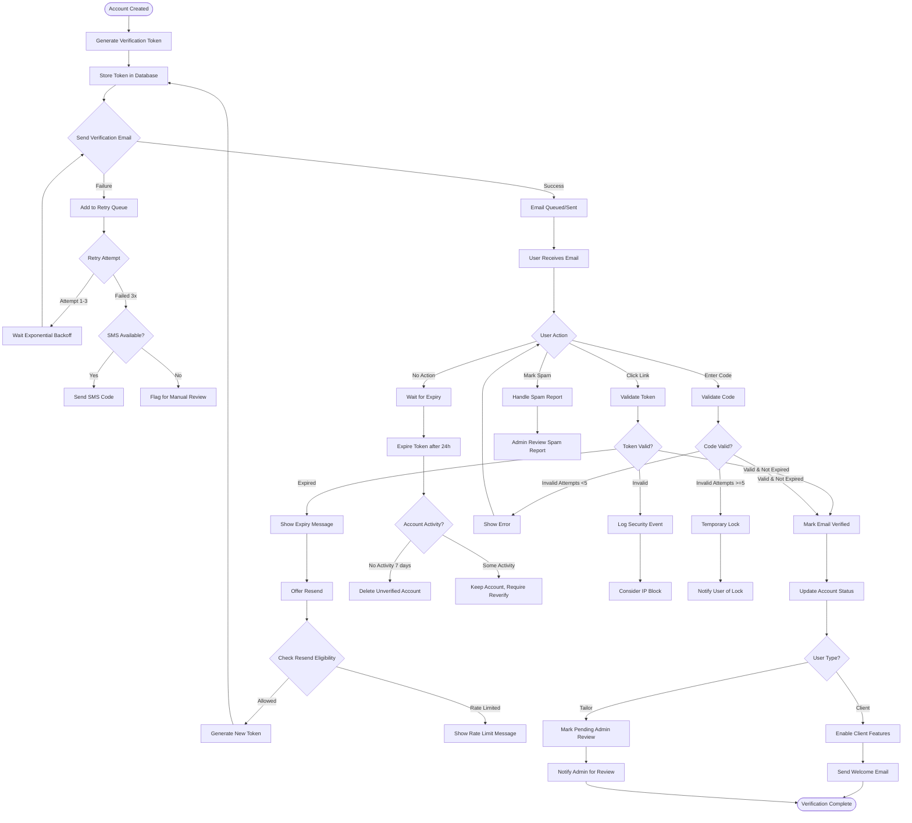

# Email Verification Business Flow

## Executive Summary
Email verification is a critical security gate that ensures user ownership of email addresses, prevents spam accounts, and maintains platform integrity. This flow handles initial verification, re-verification scenarios, and edge cases with appropriate security measures.

## Core Verification Flow



## Detailed Business Logic

### 1. Token Generation Strategy

#### Token Specifications
```
Token Structure:
- Type: URL-safe random string
- Length: 32 characters
- Entropy: 192 bits
- Format: Base64URL encoded
- Uniqueness: Guaranteed unique in database

Alternate Code:
- Type: Numeric code for mobile entry
- Length: 6 digits
- Format: 000-000 (displayed with hyphen)
- Valid alongside token
- Different expiry rules (shorter)
```

#### Storage Schema
```
verification_tokens {
  id: UUID
  user_id: UUID (foreign key)
  token_hash: VARCHAR(64) (SHA-256 of token)
  code: VARCHAR(6) (encrypted)
  created_at: TIMESTAMP
  expires_at: TIMESTAMP
  used_at: TIMESTAMP (nullable)
  ip_address: INET (requesting IP)
  user_agent: TEXT
  attempt_count: INTEGER (default 0)
  token_type: ENUM('registration', 'email_change', 'security')
}
```

### 2. Email Delivery Logic

#### Primary Email Service (SendGrid)
```
Email Template Variables:
{
  user_name: "John Doe",
  verification_link: "https://app.stitchandwear.com/verify?token=xxx",
  verification_code: "123-456",
  expiry_time: "24 hours",
  support_email: "support@stitchandwear.com",
  unsubscribe_link: "https://app.stitchandwear.com/unsubscribe",
  company_address: "Lagos, Nigeria"
}

Delivery Settings:
- Priority: High
- Track Opens: Yes
- Track Clicks: Yes
- Retry on Soft Bounce: Yes (3 attempts)
- Categories: ["verification", "transactional"]
```

#### Retry Logic
```
Exponential Backoff:
- Attempt 1: Immediate
- Attempt 2: After 1 minute
- Attempt 3: After 5 minutes
- Attempt 4: After 15 minutes
- Attempt 5: After 1 hour
- Final: Add to manual review queue

Retry Conditions:
- Temporary failure (4xx status)
- Network timeout
- Rate limit exceeded
- Service temporarily unavailable

No Retry Conditions:
- Hard bounce
- Invalid email format
- Blocked domain
- User unsubscribed
```

#### SMS Fallback (Twilio)
```
SMS Activation Conditions:
- Email failed 3+ times
- User opted for SMS verification
- Email provider blocking detected
- User in SMS-preferred region

SMS Format:
"Your Stitch & Wear verification code is: 123-456. 
Valid for 10 minutes. Reply STOP to opt out."

SMS Rules:
- One SMS per phone number per hour
- Maximum 3 SMS per day
- Expires in 10 minutes (shorter than email)
- Cost tracking per SMS
```

### 3. Verification Link Structure

#### URL Components
```
Base URL: https://app.stitchandwear.com/verify
Parameters:
- token: 32-character verification token
- type: verification type (registration|email_change|security)
- redirect: optional redirect path after verification

Example:
https://app.stitchandwear.com/verify?token=aBcD1234...&type=registration&redirect=/dashboard

Mobile Deep Link:
stitchandwear://verify?token=aBcD1234...
```

#### Security Headers
```
Link Security:
- HTTPS only
- HSTS enabled
- CSP headers configured
- X-Frame-Options: DENY
- Rate limiting: 10 requests per minute per IP
```

### 4. Verification Process

#### Link Click Verification
```
Step 1: Extract token from URL
Step 2: Validate token format
Step 3: Query database for token hash
Step 4: Check expiry timestamp
Step 5: Verify token not already used
Step 6: Check IP geography (optional)
Step 7: Update account status
Step 8: Mark token as used
Step 9: Log verification event
Step 10: Redirect to appropriate page
```

#### Code Entry Verification
```
Step 1: Receive code from user input
Step 2: Normalize code (remove spaces/hyphens)
Step 3: Query by user_id and code
Step 4: Check attempt count (<5)
Step 5: Verify expiry (10 minutes for code)
Step 6: If invalid, increment attempt count
Step 7: If valid, proceed with verification
Step 8: Clear all codes for user
Step 9: Log verification event
```

### 5. Resend Logic

#### Resend Rules
```
Cooldown Periods:
- First resend: Immediate (in case of delivery failure)
- Second resend: 5-minute cooldown
- Third resend: 15-minute cooldown
- Fourth+ resend: 1-hour cooldown

Daily Limits:
- Maximum 5 resends per 24 hours
- Maximum 10 resends per week
- Block after 20 lifetime resends

Resend Triggers:
- User request via UI
- Automatic after email bounce
- Admin-initiated resend
- API request (with authentication)
```

#### Token Rotation
```
On Resend:
1. Invalidate all existing tokens for user
2. Generate new token and code
3. Reset attempt counters
4. Update expiry time
5. Log resend event with reason
6. Send new verification email/SMS
```

### 6. Expiry Handling

#### Token Expiry Rules
```
Default Expiry:
- Email token: 24 hours
- SMS code: 10 minutes
- Magic link: 15 minutes
- QR code: 5 minutes

Extended Expiry (Special Cases):
- Corporate accounts: 72 hours
- Invited users: 7 days
- Admin-created accounts: 30 days

Post-Expiry Actions:
- Show friendly expiry message
- Offer immediate resend
- Log expiry event
- Clean up expired tokens (daily cron)
```

#### Account Cleanup
```
Unverified Account Lifecycle:
- 0-24 hours: Full account, awaiting verification
- 24-48 hours: Verification expired, resend available
- 48 hours - 7 days: Grace period, email reminders sent
- 7-30 days: Account locked, reactivation possible
- After 30 days: Account deleted, email released

Deletion Process:
1. Check for any paid transactions
2. Export account data for compliance
3. Delete personal information
4. Retain anonymized analytics data
5. Release email for reuse
6. Send deletion confirmation (if email verified elsewhere)
```

### 7. Security Measures

#### Abuse Prevention
```
Rate Limiting:
- Per IP: 5 verification attempts per hour
- Per Email: 10 attempts per day
- Per Phone: 5 attempts per day
- Global: 1000 verifications per hour

Suspicious Pattern Detection:
- Multiple accounts from same IP
- Rapid verification attempts
- Use of disposable email domains
- Automated bot patterns
- Distributed attack patterns

Response to Abuse:
1. Temporary IP block (1 hour)
2. CAPTCHA requirement
3. Manual review flag
4. Extended cooldowns
5. Permanent IP ban (severe cases)
```

#### Token Security
```
Storage Security:
- Tokens hashed with SHA-256 before storage
- Codes encrypted with AES-256
- No plain text tokens in logs
- Automatic token rotation on breach

Validation Security:
- Constant-time comparison
- No user enumeration
- Generic error messages
- Security event logging
- Honeypot tokens for detection
```

### 8. Special Scenarios

#### Email Change Verification
```
Process:
1. User requests email change
2. Send verification to NEW email
3. Send notification to OLD email
4. Require verification within 1 hour
5. On verification, update email
6. Send confirmation to both emails
7. Provide 24-hour reversal option

Security:
- Require password confirmation
- Two-factor if enabled
- IP geography check
- Device fingerprint validation
```

#### Bulk Verification (Enterprise)
```
For Corporate Accounts:
1. Admin uploads user list
2. System generates unique tokens
3. Sends customized corporate emails
4. Extended 7-day verification window
5. Daily status reports to admin
6. Automatic reminder at day 3 and 6
7. Bulk resend capability
```

#### Offline Verification
```
For Limited Connectivity:
1. Generate QR code with signed payload
2. User scans with mobile app
3. App verifies signature offline
4. Syncs verification when online
5. Fallback to SMS if QR fails
```

### 9. Analytics & Monitoring

#### Key Metrics
```
Delivery Metrics:
- Email delivery rate: Target >98%
- Email open rate: Target >70%
- Click-through rate: Target >60%
- Time to verify: Target <5 minutes median

Quality Metrics:
- Verification success rate: Target >85%
- Resend rate: Target <15%
- Expiry rate: Target <20%
- Support tickets: Target <1%

Security Metrics:
- Abuse detection rate
- False positive rate: Target <0.1%
- Token compromise incidents: Target 0
- Successful attack attempts: Target 0
```

#### Monitoring Alerts
```
Critical Alerts:
- Delivery rate <90%
- Verification rate <70%
- Spike in failed attempts (>50/hour)
- Token reuse detected
- Database token collision

Warning Alerts:
- Increasing resend rate (>25%)
- High expiry rate (>30%)
- Unusual geographic patterns
- Elevated support tickets
```

### 10. User Communication

#### Email Templates
```
Initial Verification:
- Subject: "Verify your Stitch & Wear account"
- Friendly, welcoming tone
- Clear CTA button
- Alternative code option
- Support information

Reminder Email (Day 3):
- Subject: "Don't forget to verify your account"
- Urgency without pressure
- Benefits of verification
- Easy resend option

Final Warning (Day 6):
- Subject: "Your account will be deleted tomorrow"
- Clear consequences
- One-click verification
- Recovery instructions

Verification Success:
- Subject: "Welcome to Stitch & Wear!"
- Celebration tone
- Next steps guide
- Feature highlights
```

#### Error Messages
```
User-Facing Messages:
- Invalid token: "This verification link is invalid or has expired."
- Already verified: "Your email is already verified. Please sign in."
- Rate limited: "Too many attempts. Please try again in X minutes."
- Expired: "This verification link has expired. Click here to resend."
- Success: "Email verified successfully! Redirecting to your dashboard..."

System Logs:
- Include full context
- User ID (hashed)
- Timestamp
- IP address
- User agent
- Action attempted
- Result
- Error details (if any)
```

## Integration Requirements

### External Services
- **SendGrid**: Primary email delivery
- **Twilio**: SMS fallback
- **MaxMind**: Geographic IP validation
- **Google reCAPTCHA**: Bot prevention
- **DataDog**: Monitoring and alerts

### Internal Systems
- **User Service**: Account status updates
- **Notification Service**: Email/SMS orchestration
- **Analytics Service**: Event tracking
- **Security Service**: Threat detection
- **Admin Portal**: Manual intervention tools