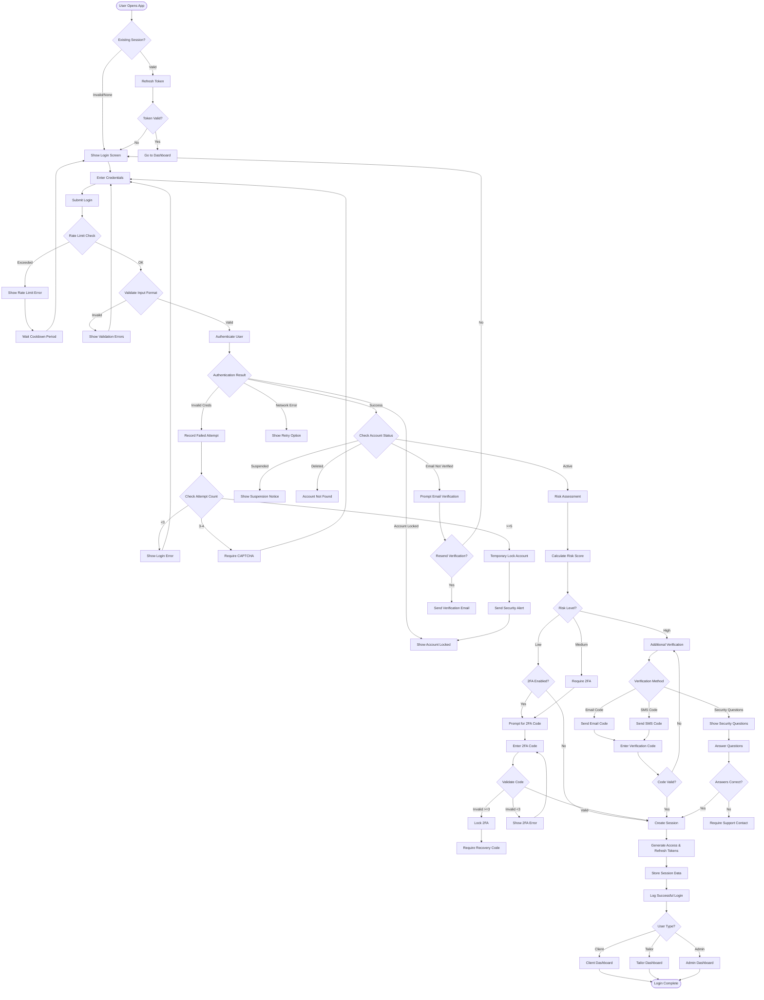

# User Login Business Flow

## Executive Summary
The login journey balances security with user convenience, implementing progressive security measures based on risk assessment. The system supports multiple authentication methods while maintaining consistent security standards across all entry points.

## Primary Login Flow



## Detailed Business Rules

### 1. Session Management

#### Session Lifecycle
```
Session States:
- ACTIVE: Valid tokens, recent activity
- IDLE: Valid tokens, no recent activity (>15 min)
- EXPIRED: Tokens expired, refresh required
- REVOKED: Manually terminated or security trigger
- SUSPENDED: Temporary suspension for security

Session Tokens:
Access Token:
- Lifetime: 15 minutes
- Format: JWT
- Contains: user_id, role, permissions
- Storage: Memory only (never localStorage)

Refresh Token:
- Lifetime: 7 days (remember me: 30 days)
- Format: Opaque token
- Storage: Secure HTTP-only cookie
- Rotation: New token on each refresh

Session Storage:
{
  session_id: UUID,
  user_id: UUID,
  access_token_hash: SHA256,
  refresh_token_hash: SHA256,
  ip_address: INET,
  user_agent: TEXT,
  device_fingerprint: TEXT,
  created_at: TIMESTAMP,
  last_activity: TIMESTAMP,
  expires_at: TIMESTAMP,
  revoked_at: TIMESTAMP (nullable),
  risk_score: DECIMAL
}
```

#### Remember Me Logic
```
Remember Me Behavior:
- Extends refresh token to 30 days
- Stores device fingerprint
- Requires re-authentication for sensitive actions
- Maximum 5 remembered devices per user
- Auto-cleanup of oldest device when limit reached

Sensitive Actions Requiring Re-auth:
- Password change
- Email change
- Payment method addition
- Account deletion
- Security settings modification
- Large transactions (>$500)
```

### 2. Rate Limiting Strategy

#### Progressive Rate Limiting
```
Rate Limit Tiers:
Global (per IP):
- 10 attempts per minute
- 50 attempts per hour
- 200 attempts per day

Per Account:
- 5 attempts per 15 minutes
- 20 attempts per hour
- 50 attempts per day

Per Device:
- 3 consecutive failures trigger CAPTCHA
- 5 failures trigger 15-minute cooldown
- 10 failures trigger 1-hour lock

Cooldown Periods:
- After 3 failures: CAPTCHA required
- After 5 failures: 15-minute wait
- After 7 failures: 1-hour wait
- After 10 failures: 24-hour lock
- After 15 failures: Account review required
```

#### CAPTCHA Implementation
```
CAPTCHA Triggers:
- 3+ failed login attempts
- Suspicious behavior patterns
- High-risk geographic location
- Automated behavior detected
- Multiple accounts from same IP

CAPTCHA Types:
Primary: Google reCAPTCHA v3 (invisible)
Fallback: reCAPTCHA v2 (checkbox)
Alternative: Custom image challenge
Accessibility: Audio challenge option
```

### 3. Risk Assessment Engine

#### Risk Scoring Factors
```
Risk Calculation:
Base Score = 0

Location Risk:
- New country: +30 points
- New city: +15 points
- VPN/Proxy detected: +25 points
- Tor network: +50 points

Device Risk:
- New device: +20 points
- New browser: +10 points
- Incognito mode: +5 points
- Modified user agent: +15 points

Behavior Risk:
- Rapid attempts: +10 points
- After midnight local: +5 points
- Multiple account access: +20 points
- Clipboard password: +5 points

Account Risk:
- Recent password change: +10 points
- Recent security incident: +30 points
- High-value account: +10 points
- Admin privileges: +20 points

Risk Levels:
- Low: 0-25 points
- Medium: 26-50 points
- High: 51-75 points
- Critical: 76+ points
```

#### Risk-Based Responses
```
Low Risk (0-25):
- Standard login flow
- Optional 2FA if enabled
- Normal session duration

Medium Risk (26-50):
- Mandatory 2FA (if available)
- Email notification of login
- Reduced session duration (2 hours)
- Activity monitoring enabled

High Risk (51-75):
- Additional verification required
- SMS or email code mandatory
- Session limited to 1 hour
- Restricted permissions
- Real-time monitoring

Critical Risk (76+):
- Block login attempt
- Require identity verification
- Notify user via all channels
- Flag for security review
- Consider account freeze
```

### 4. Multi-Factor Authentication

#### 2FA Methods
```
Available Methods:
1. TOTP (Google Authenticator):
   - 6-digit code
   - 30-second window
   - ±1 window tolerance
   - Backup codes provided

2. SMS OTP:
   - 6-digit code
   - 10-minute validity
   - Rate limited to 3 per hour
   - Fallback to voice call

3. Email OTP:
   - 6-digit code
   - 15-minute validity
   - HTML and plain text versions
   - Resend after 1 minute

4. Biometric (Mobile):
   - FaceID/TouchID
   - Fallback to device PIN
   - Requires app installation

5. Hardware Key (FIDO2):
   - WebAuthn support
   - Backup key required
   - Cross-platform compatible
```

#### Backup Recovery
```
Recovery Codes:
- 10 codes generated
- 12 characters each
- Single use only
- Encrypted storage
- Download/print option
- Regeneration requires authentication

Recovery Flow:
1. User selects "Lost access to 2FA"
2. Enter recovery code
3. If valid, bypass 2FA
4. Force 2FA reconfiguration
5. Generate new recovery codes
6. Send security notification
```

### 5. Social Login Integration

#### OAuth Providers
```
Supported Providers:
1. Google:
   - OAuth 2.0
   - Email and profile scope
   - Automatic email verification
   - Google Workspace support

2. Facebook:
   - OAuth 2.0
   - Email and public profile
   - Additional permissions optional
   - Instagram linkage possible

3. Apple:
   - Sign in with Apple
   - Hide email option support
   - Relay email handling
   - Biometric authentication

4. Microsoft:
   - Azure AD integration
   - Corporate SSO support
   - Conditional access policies
   - MFA inheritance
```

#### Account Linking
```
Linking Rules:
- Email must match exactly
- Require password for first link
- Maximum 3 social providers per account
- Can unlink if password exists
- Cannot unlink last auth method

Conflict Resolution:
- Existing email: Prompt to link
- Different email: Create new account
- Unverified email: Require verification
- Deleted account: Block registration
```

### 6. Password Validation

#### Password Requirements
```
Minimum Requirements:
- Length: 8 characters minimum
- Uppercase: At least 1
- Lowercase: At least 1
- Number: At least 1
- Special character: At least 1

Additional Checks:
- Not in common passwords list (top 10000)
- Not similar to email or name
- Not previously used (last 5)
- No sequential characters (abc, 123)
- No repeated characters (aaa)
- Entropy score > 40 bits
```

#### Password Security
```
Storage:
- Algorithm: Argon2id
- Memory: 64 MB
- Iterations: 3
- Parallelism: 4
- Salt: 16 bytes random

Comparison:
- Constant-time comparison
- No timing attacks
- Rate limited checks
- Failed attempt logging
```

### 7. Account Status Handling

#### Status Verification
```
Account States:
PENDING_VERIFICATION:
- Show verification prompt
- Offer resend option
- Allow read-only access
- 30-day grace period

ACTIVE:
- Full access granted
- Normal login flow
- All features available

SUSPENDED:
- Show suspension reason
- Provide appeal link
- Block all access
- Retention period: 90 days

LOCKED:
- Security lock message
- Recovery options shown
- Support contact provided
- Unlock via email/SMS

DELETED:
- Generic "account not found"
- No information leakage
- Prevent re-registration (90 days)
- GDPR compliance
```

### 8. Device Management

#### Device Tracking
```
Device Fingerprint:
- Browser version
- Screen resolution
- Timezone
- Language settings
- Canvas fingerprint
- WebGL fingerprint
- Audio context
- Font detection

Device Storage:
{
  device_id: UUID,
  user_id: UUID,
  fingerprint_hash: TEXT,
  device_name: TEXT,
  device_type: ENUM,
  last_seen: TIMESTAMP,
  trusted: BOOLEAN,
  created_at: TIMESTAMP
}

Trust Levels:
- New Device: Requires full authentication
- Recognized: Standard authentication
- Trusted: Reduced authentication
- Suspicious: Enhanced authentication
```

#### Device Limits
```
Restrictions:
- Maximum 10 devices per user
- Auto-remove after 90 days inactive
- Manual device management UI
- Notification on new device
- Bulk device logout option
```

### 9. Security Monitoring

#### Login Analytics
```
Tracked Events:
- Successful logins
- Failed attempts
- Password resets
- 2FA challenges
- Account locks
- Suspicious activities

Metrics:
- Login success rate
- Average login time
- Geographic distribution
- Device type breakdown
- Peak login hours
- Unusual pattern detection
```

#### Alerting Rules
```
User Alerts:
- New device login
- Login from new location
- Multiple failed attempts
- Password changed
- 2FA disabled
- Suspicious activity detected

Admin Alerts:
- Brute force attempts
- Distributed attacks
- Account takeover attempts
- Unusual traffic patterns
- System anomalies
```

### 10. Special Login Scenarios

#### SSO Integration
```
Enterprise SSO:
- SAML 2.0 support
- Custom identity providers
- Attribute mapping
- Just-in-time provisioning
- Session synchronization
- Single logout support
```

#### Impersonation
```
Admin Impersonation:
- Requires admin privileges
- Audit log mandatory
- Time-limited (1 hour)
- Read-only by default
- User notification required
- Reason documentation
```

#### Emergency Access
```
Emergency Procedures:
- Account recovery via support
- Identity verification required
- Video call verification option
- Document upload for proof
- 48-hour processing time
- Temporary password issued
```

## Performance Requirements

### Response Times
- Login request: <2 seconds
- Token refresh: <500ms
- 2FA verification: <1 second
- Risk assessment: <200ms
- Session creation: <300ms

### Availability
- Uptime target: 99.9%
- Max downtime: 43 minutes/month
- Failover time: <30 seconds
- Data center redundancy
- CDN for static assets

## Compliance Requirements

### Regulatory
- GDPR compliance (EU)
- PCI DSS (payment data)
- SOC 2 Type II
- ISO 27001
- Nigerian Data Protection

### Audit Requirements
- All login attempts logged
- IP addresses retained 90 days
- Failed attempts tracked
- Security events archived
- Annual security audit