# Password Recovery Business Flow

## Executive Summary
The password recovery process provides secure, user-friendly account recovery while preventing account takeover attempts. The system implements multiple verification layers and offers various recovery methods based on account configuration and risk assessment.

## Password Recovery Flow

```mermaid
flowchart TB
    Start([Forgot Password]) --> InitiateRecovery[Click Forgot Password]
    InitiateRecovery --> EnterIdentifier[Enter Email/Phone/Username]
    
    EnterIdentifier --> ValidateInput{Validate Format}
    ValidateInput -->|Invalid| ShowFormatError[Show Format Error]
    ValidateInput -->|Valid| RateLimitCheck{Check Rate Limit}
    
    ShowFormatError --> EnterIdentifier
    
    RateLimitCheck -->|Exceeded| ShowRateLimit[Show Rate Limit Error]
    RateLimitCheck -->|OK| AccountLookup[Lookup Account]
    
    ShowRateLimit --> DelayPeriod[Enforce Delay Period]
    DelayPeriod --> Start
    
    AccountLookup --> AccountFound{Account Exists?}
    AccountFound -->|No| GenericResponse[Show Generic Success Message]
    AccountFound -->|Yes| CheckAccountStatus{Check Account Status}
    
    GenericResponse --> LogAttempt[Log Recovery Attempt]
    
    CheckAccountStatus -->|Suspended/Locked| GenericResponse
    CheckAccountStatus -->|Deleted| GenericResponse
    CheckAccountStatus -->|Active| RiskAssessment[Assess Recovery Risk]
    
    RiskAssessment --> CalculateRisk[Calculate Risk Score]
    CalculateRisk --> RiskLevel{Risk Level?}
    
    RiskLevel -->|Low| StandardRecovery[Standard Recovery]
    RiskLevel -->|Medium| EnhancedRecovery[Enhanced Verification]
    RiskLevel -->|High| ManualRecovery[Require Support Contact]
    
    StandardRecovery --> ChooseMethod{Recovery Method}
    ChooseMethod -->|Email| SendEmailToken[Send Email Reset Link]
    ChooseMethod -->|SMS| SendSMSCode[Send SMS Code]
    ChooseMethod -->|Security Questions| ShowQuestions[Display Security Questions]
    
    EnhancedRecovery --> MultiFactorVerify[Require Multiple Verifications]
    MultiFactorVerify --> SendEmailToken
    MultiFactorVerify --> SendSMSCode
    
    SendEmailToken --> EmailSent[Email Sent Confirmation]
    EmailSent --> UserClicksLink{User Clicks Link?}
    
    UserClicksLink -->|Yes| ValidateToken{Validate Token}
    UserClicksLink -->|No| TokenExpires[Token Expires after 1 hour]
    
    ValidateToken -->|Invalid| ShowInvalidToken[Show Invalid Token Error]
    ValidateToken -->|Expired| ShowExpiredToken[Show Expired Token Error]
    ValidateToken -->|Valid| CheckTokenUsage{Token Already Used?}
    
    ShowInvalidToken --> Start
    ShowExpiredToken --> OfferResend[Offer to Resend]
    OfferResend --> Start
    
    CheckTokenUsage -->|Yes| SecurityAlert[Trigger Security Alert]
    CheckTokenUsage -->|No| AdditionalVerify{Need Additional Verification?}
    
    SecurityAlert --> BlockRecovery[Block Recovery Process]
    BlockRecovery --> NotifyUser[Notify User of Suspicious Activity]
    
    AdditionalVerify -->|Yes Based on Risk| SecondFactorPrompt[Prompt for Second Factor]
    AdditionalVerify -->|No| PasswordResetForm[Show Password Reset Form]
    
    SecondFactorPrompt --> EnterSecondFactor[Enter Code/Answer]
    EnterSecondFactor --> ValidateSecond{Validate Second Factor}
    
    ValidateSecond -->|Invalid| RetrySecond{Retry Attempts}
    ValidateSecond -->|Valid| PasswordResetForm
    
    RetrySecond -->|<3| SecondFactorPrompt
    RetrySecond -->|>=3| LockRecovery[Lock Recovery Process]
    
    SendSMSCode --> SMSSent[SMS Sent Confirmation]
    SMSSent --> EnterSMSCode[User Enters Code]
    EnterSMSCode --> ValidateSMS{Validate SMS Code}
    
    ValidateSMS -->|Invalid| RetrySMS{Retry Attempts}
    ValidateSMS -->|Valid| PasswordResetForm
    
    RetrySMS -->|<3| EnterSMSCode
    RetrySMS -->|>=3| LockRecovery
    
    ShowQuestions --> AnswerQuestions[User Answers Questions]
    AnswerQuestions --> ValidateAnswers{Validate Answers}
    
    ValidateAnswers -->|Incorrect| RetryAnswers{Retry Attempts}
    ValidateAnswers -->|Correct| PasswordResetForm
    
    RetryAnswers -->|<3| ShowQuestions
    RetryAnswers -->|>=3| LockRecovery
    
    PasswordResetForm --> EnterNewPassword[Enter New Password]
    EnterNewPassword --> ValidatePassword{Validate Password}
    
    ValidatePassword -->|Weak| ShowRequirements[Show Password Requirements]
    ValidatePassword -->|Previously Used| ShowPreviouslyUsed[Show Previously Used Error]
    ValidatePassword -->|Valid| ConfirmPassword[Confirm New Password]
    
    ShowRequirements --> EnterNewPassword
    ShowPreviouslyUsed --> EnterNewPassword
    
    ConfirmPassword --> PasswordMatch{Passwords Match?}
    PasswordMatch -->|No| ShowMismatch[Show Mismatch Error]
    PasswordMatch -->|Yes| UpdatePassword[Update Password in Database]
    
    ShowMismatch --> EnterNewPassword
    
    UpdatePassword --> InvalidateSessions[Invalidate All Sessions]
    InvalidateSessions --> SendConfirmation[Send Confirmation Email]
    SendConfirmation --> ForceRelogin[Redirect to Login]
    
    ForceRelogin --> Success([Password Reset Complete])
    
    ManualRecovery --> ShowSupportInfo[Show Support Contact Info]
    ShowSupportInfo --> CreateTicket[Create Support Ticket]
    CreateTicket --> ManualProcess([Manual Recovery Process])
    
    LockRecovery --> RecoveryLocked[Show Recovery Locked Message]
    RecoveryLocked --> WaitPeriod[24 Hour Wait Period]
    
    TokenExpires --> Cleanup[Clean Up Expired Token]
```



## Detailed Business Logic

### 1. Recovery Initiation

#### Entry Points
```
Recovery Triggers:
- Login page "Forgot Password" link
- Account locked message recovery option
- Support-initiated recovery
- API endpoint for mobile apps
- Email link from security alerts

Initial Validation:
- Input format (email/phone/username)
- Rate limiting check
- CAPTCHA after 2 attempts
- Geographic anomaly detection
- Device fingerprinting
```

#### Account Identification
```
Lookup Strategy:
1. Primary: Email address (case-insensitive)
2. Secondary: Phone number (normalized)
3. Tertiary: Username (if enabled)
4. Never reveal if account exists

Privacy Protection:
- Always show: "If an account exists, we've sent recovery instructions"
- Same response time for existing and non-existing accounts
- Log all attempts for security monitoring
- No user enumeration possible
```

### 2. Risk Assessment

#### Risk Scoring Matrix
```
Risk Factors:
Location Risk:
- Different country: +40 points
- Different city: +20 points
- VPN/Proxy: +30 points
- Tor network: +50 points

Timing Risk:
- Within 24h of password change: +30 points
- Multiple recovery attempts: +20 points per attempt
- Outside normal hours: +10 points
- Rapid succession attempts: +25 points

Account Risk:
- High-value account: +15 points
- Admin privileges: +25 points
- Recent security incident: +35 points
- Multiple linked accounts: +10 points

Behavior Risk:
- Unusual recovery method: +15 points
- Different device type: +10 points
- Automated behavior: +30 points
- Failed security answers: +20 points

Risk Levels:
- Low: 0-30 points (Standard recovery)
- Medium: 31-60 points (Enhanced verification)
- High: 61+ points (Manual review required)
```

### 3. Recovery Methods

#### Email Recovery
```
Email Token:
- Format: 32-character URL-safe token
- Validity: 1 hour (configurable)
- Single use only
- Encrypted in database
- Unique per recovery attempt

Email Content:
- Personalized greeting
- Clear explanation of request
- Prominent reset button
- Token embedded in URL
- Warning if not requested
- Support contact information

URL Structure:
https://app.stitchandwear.com/reset-password?token=xxx&email=xxx
```

#### SMS Recovery
```
SMS Code:
- Format: 6-digit numeric
- Validity: 10 minutes
- Maximum 3 attempts
- Rate limited: 1 per minute
- Cost tracking enabled

SMS Content:
"Your Stitch & Wear reset code: 123456
Valid for 10 minutes.
If you didn't request this, please ignore."

Fallback Options:
- Voice call after 2 minutes
- Email option if SMS fails
- Support contact for issues
```

#### Security Questions
```
Question Configuration:
- User selects 3 from 10 questions
- Answers hashed with bcrypt
- Case-insensitive comparison
- Fuzzy matching (85% similarity)

Question Pool:
1. Mother's maiden name
2. First pet's name
3. Elementary school name
4. Favorite teacher
5. Birth city
6. First car make/model
7. Favorite book
8. Childhood best friend
9. Father's middle name
10. Favorite food

Answer Validation:
- Minimum 2 correct answers required
- Partial credit for close matches
- 3 attempts maximum
- Lock after failures
```

#### Backup Codes
```
Backup Code Recovery:
- Pre-generated 10 codes
- 12 characters alphanumeric
- Single use only
- Requires 1 valid code
- Triggers security review

Post-Recovery:
- Force new backup codes generation
- Notify all registered devices
- Security audit log entry
- Optional: Require 2FA setup
```

### 4. Token Management

#### Token Generation
```
Token Properties:
{
  token_id: UUID,
  user_id: UUID,
  token_hash: SHA256,
  token_type: 'password_reset',
  created_at: TIMESTAMP,
  expires_at: TIMESTAMP,
  used_at: TIMESTAMP (nullable),
  ip_address: INET,
  user_agent: TEXT,
  risk_score: INTEGER,
  verification_method: TEXT
}

Security Measures:
- Cryptographically secure random generation
- Constant-time token comparison
- Automatic expiry after 1 hour
- Invalidate on password change
- Invalidate all tokens on successful reset
```

#### Token Validation
```
Validation Steps:
1. Check token format
2. Verify not expired
3. Confirm not used
4. Validate associated account
5. Check risk indicators
6. Verify IP consistency (optional)
7. Log validation attempt

Failure Handling:
- Generic error message
- Log security event
- Increment failure counter
- Consider blocking if suspicious
```

### 5. Password Reset Form

#### Password Requirements
```
Minimum Criteria:
- Length: 8-128 characters
- Complexity: Upper + Lower + Number + Special
- Not in breach database (HaveIBeenPwned)
- Not similar to email/username
- Not in last 5 passwords
- Entropy score > 50 bits

Password Strength Indicator:
- Real-time feedback
- Color-coded strength bar
- Specific improvement suggestions
- Time-to-crack estimate
- Common pattern warnings
```

#### Form Security
```
Security Features:
- Password visibility toggle
- Paste disabled (optional)
- Auto-complete disabled
- Session timeout: 15 minutes
- CSRF token required
- Rate limiting: 5 attempts

Validation Messages:
- "Password is too weak"
- "Password was recently used"
- "Passwords don't match"
- "Session expired, please start over"
- "Invalid reset token"
```

### 6. Multi-Factor Recovery

#### Enhanced Verification Flow
```
For Medium Risk:
1. Email token required
2. PLUS one of:
   - SMS code
   - Security question
   - Backup code
   - Trusted device approval

For High Risk:
1. Email token required
2. AND SMS code required
3. AND identity verification:
   - Government ID upload
   - Video selfie
   - Support call
```

#### Trusted Device Approval
```
Device Notification:
- Push notification to app
- In-app approval prompt
- 5-minute timeout
- Shows requesting IP/location
- One-tap approve/deny

Requirements:
- Device previously marked trusted
- App installed and logged in
- Push notifications enabled
- Device not compromised
```

### 7. Post-Reset Actions

#### Session Management
```
Immediate Actions:
1. Invalidate all existing sessions
2. Revoke all refresh tokens
3. Clear remember-me cookies
4. Force re-authentication
5. Reset failed login counters

Notifications:
- Email: Password changed successfully
- SMS: Security alert (if enabled)
- Push: All devices logged out
- Dashboard: Security event notice
```

#### Security Logging
```
Logged Events:
{
  event_type: 'password_reset',
  user_id: UUID,
  timestamp: ISO8601,
  ip_address: INET,
  user_agent: TEXT,
  reset_method: TEXT,
  risk_score: INTEGER,
  success: BOOLEAN,
  failure_reason: TEXT (if applicable),
  session_invalidated_count: INTEGER,
  notification_sent: ARRAY
}
```

### 8. Account Recovery Support

#### Manual Recovery Process
```
Support Verification:
1. Ticket creation with reference number
2. Identity verification required:
   - Government ID
   - Proof of account ownership
   - Security question answers
   - Transaction history
3. Video call verification (high-value)
4. 24-48 hour processing time
5. Temporary password issued
6. Mandatory password change on login

Escalation Path:
Level 1: Email/chat support
Level 2: Phone support
Level 3: Senior support specialist
Level 4: Security team review
Level 5: Executive approval (rare)
```

### 9. Attack Prevention

#### Common Attack Mitigation
```
Timing Attacks:
- Constant response time
- Artificial delays added
- Same process for all attempts

Enumeration Attacks:
- Generic success messages
- No account existence hints
- Rate limiting enforced

Token Hijacking:
- HTTPS only
- Short expiry times
- IP validation (optional)
- Single use enforcement

Password Spraying:
- Account lockout policies
- CAPTCHA challenges
- Behavioral analysis
- Distributed attempt detection
```

#### Monitoring & Alerts
```
Security Alerts:
- Multiple reset requests (>3 in 24h)
- Different geographic location
- High risk score attempts
- Failed verification attempts
- Suspicious patterns detected

Admin Notifications:
- Bulk reset attempts
- Coordinated attacks
- System anomalies
- High-profile account attempts
```

### 10. Compliance & Legal

#### Data Protection
```
GDPR Compliance:
- Right to account recovery
- Data minimization
- Audit trail maintenance
- 30-day log retention
- Encryption requirements

Regional Requirements:
- Nigeria: NDPR compliance
- EU: GDPR Article 32
- US: State privacy laws
- Industry: PCI DSS if payment data
```

#### Audit Requirements
```
Audit Log Requirements:
- All recovery attempts
- Success and failure reasons
- Risk scores and decisions
- Support interventions
- Security incidents
- Method effectiveness metrics

Retention Policy:
- Successful resets: 90 days
- Failed attempts: 30 days
- Security incidents: 1 year
- Support cases: 2 years
```

## Performance Metrics

### Success Metrics
- Recovery success rate: >85%
- Average time to reset: <5 minutes
- Support ticket rate: <5%
- Security incident rate: <0.1%

### Quality Metrics
- User satisfaction: >4.5/5
- Abandoned recovery rate: <20%
- Multiple attempt rate: <15%
- False positive rate: <1%

### Security Metrics
- Account takeover rate: <0.01%
- Token compromise rate: 0%
- Successful attack rate: 0%
- Detection accuracy: >95%