# Social Authentication Business Flow

## Executive Summary
Social authentication provides users with convenient, secure login options using their existing social media accounts. The system handles account linking, data synchronization, and privacy preferences while maintaining security standards equivalent to traditional authentication.

## Social Authentication Flow

```mermaid
flowchart TB
    Start([User Chooses Social Login]) --> SelectProvider{Select Provider}
    SelectProvider -->|Google| InitGoogle[Initialize Google OAuth]
    SelectProvider -->|Facebook| InitFacebook[Initialize Facebook OAuth]
    SelectProvider -->|Apple| InitApple[Initialize Apple Sign In]
    
    InitGoogle --> GoogleConsent[Google Consent Screen]
    InitFacebook --> FacebookConsent[Facebook Login Dialog]
    InitApple --> AppleConsent[Apple ID Authentication]
    
    GoogleConsent --> GoogleAuth{User Authorizes?}
    FacebookConsent --> FacebookAuth{User Authorizes?}
    AppleConsent --> AppleAuth{User Authorizes?}
    
    GoogleAuth -->|No| CancelFlow[Return to Login]
    GoogleAuth -->|Yes| GoogleCallback[Receive Google Token]
    
    FacebookAuth -->|No| CancelFlow
    FacebookAuth -->|Yes| FacebookCallback[Receive Facebook Token]
    
    AppleAuth -->|No| CancelFlow
    AppleAuth -->|Yes| AppleCallback[Receive Apple Token]
    
    GoogleCallback --> ValidateGoogleToken[Validate with Google]
    FacebookCallback --> ValidateFacebookToken[Validate with Facebook]
    AppleCallback --> ValidateAppleToken[Validate with Apple]
    
    ValidateGoogleToken --> GoogleProfile[Fetch Google Profile]
    ValidateFacebookToken --> FacebookProfile[Fetch Facebook Profile]
    ValidateAppleToken --> AppleProfile[Fetch Apple Profile]
    
    GoogleProfile --> ExtractData[Extract User Data]
    FacebookProfile --> ExtractData
    AppleProfile --> ExtractData
    
    ExtractData --> CheckEmail{Email Provided?}
    CheckEmail -->|No Apple Hide Email| HandlePrivateEmail[Create Relay Email]
    CheckEmail -->|Yes| ValidateEmail{Valid Email?}
    
    HandlePrivateEmail --> ValidateEmail
    ValidateEmail -->|Invalid| RequestEmail[Request Email from User]
    ValidateEmail -->|Valid| CheckExisting{Check Existing Account}
    
    RequestEmail --> ManualEmail[User Enters Email]
    ManualEmail --> ValidateEmail
    
    CheckExisting -->|No Account| CheckEmailInUse{Email Already Registered?}
    CheckExisting -->|Account Exists| CheckProvider{Provider Linked?}
    
    CheckEmailInUse -->|Yes Different User| ShowLinkOption[Show Account Link Option]
    CheckEmailInUse -->|No| CreateAccount[Create New Account]
    
    ShowLinkOption --> UserChoice{User Decision}
    UserChoice -->|Link Accounts| RequirePassword[Require Password Verification]
    UserChoice -->|Use Different Email| RequestEmail
    UserChoice -->|Cancel| CancelFlow
    
    RequirePassword --> EnterPassword[User Enters Password]
    EnterPassword --> VerifyPassword{Password Correct?}
    
    VerifyPassword -->|No| RetryPassword{Retry Count}
    VerifyPassword -->|Yes| LinkProvider[Link Social Provider]
    
    RetryPassword -->|<3| EnterPassword
    RetryPassword -->|>=3| LockAccount[Temporary Lock]
    
    CheckProvider -->|Already Linked| RefreshToken[Refresh Social Token]
    CheckProvider -->|Different Provider| MergeData{Merge Profile Data?}
    CheckProvider -->|Not Linked| LinkProvider
    
    MergeData -->|Auto Merge| AutoMerge[Merge Non-Conflicting Data]
    MergeData -->|Manual Review| ShowConflicts[Show Data Conflicts]
    
    ShowConflicts --> UserResolve[User Resolves Conflicts]
    UserResolve --> UpdateProfile[Update Profile Data]
    
    AutoMerge --> UpdateProfile
    RefreshToken --> UpdateProfile
    LinkProvider --> UpdateProfile
    
    CreateAccount --> GenerateUsername[Generate Unique Username]
    GenerateUsername --> SetDefaults[Set Default Preferences]
    SetDefaults --> DownloadAvatar{Avatar Available?}
    
    DownloadAvatar -->|Yes| StoreAvatar[Download and Store Avatar]
    DownloadAvatar -->|No| DefaultAvatar[Use Default Avatar]
    
    StoreAvatar --> CheckUserType{Determine User Type}
    DefaultAvatar --> CheckUserType
    UpdateProfile --> CheckUserType
    
    CheckUserType -->|From Marketing| SetClient[Set as Client]
    CheckUserType -->|From Tailor Link| SetTailor[Set as Tailor Pending]
    CheckUserType -->|Unknown| AskUserType[Ask User Type]
    
    AskUserType --> UserTypeSelect{User Selects}
    UserTypeSelect -->|Client| SetClient
    UserTypeSelect -->|Tailor| SetTailor
    
    SetClient --> CreateSession[Create User Session]
    SetTailor --> TailorVerification[Require Additional Info]
    
    TailorVerification --> CollectTailorInfo[Collect Business Info]
    CollectTailorInfo --> CreateSession
    
    CreateSession --> GenerateTokens[Generate Auth Tokens]
    GenerateTokens --> StoreSocialToken[Store Social Token]
    StoreSocialToken --> SetPermissions[Set User Permissions]
    SetPermissions --> SyncContacts{Sync Contacts?}
    
    SyncContacts -->|User Approved| ImportContacts[Import Social Contacts]
    SyncContacts -->|Declined| SkipContacts[Skip Contact Import]
    
    ImportContacts --> FindConnections[Find Platform Connections]
    FindConnections --> NotifyConnections[Notify Mutual Connections]
    
    SkipContacts --> CheckFirstLogin{First Social Login?}
    NotifyConnections --> CheckFirstLogin
    
    CheckFirstLogin -->|Yes| ShowOnboarding[Show Social Onboarding]
    CheckFirstLogin -->|No| DirectToDashboard[Go to Dashboard]
    
    ShowOnboarding --> CompleteProfile[Complete Profile Setup]
    CompleteProfile --> DirectToDashboard
    
    DirectToDashboard --> Success([Social Login Complete])
    
    CancelFlow --> End([Authentication Cancelled])
    LockAccount --> End
```



## Detailed Business Logic

### 1. Provider Configuration

#### Google OAuth 2.0
```
Configuration:
Client ID: [Google Cloud Console]
Client Secret: [Secure Storage]
Redirect URI: https://app.stitchandwear.com/auth/google/callback
Scopes:
- openid (Required)
- email (Required)
- profile (Required)
- https://www.googleapis.com/auth/user.birthday.read (Optional)
- https://www.googleapis.com/auth/user.phonenumbers.read (Optional)

Response Data:
{
  id: Google User ID,
  email: Email address,
  verified_email: Boolean,
  name: Full name,
  given_name: First name,
  family_name: Last name,
  picture: Profile picture URL,
  locale: Language preference,
  hd: G Suite domain (if applicable)
}

Token Management:
- Access Token: 1 hour expiry
- Refresh Token: Long-lived (store encrypted)
- ID Token: JWT with user claims
- Revocation endpoint available
```

#### Facebook OAuth 2.0
```
Configuration:
App ID: [Facebook App Dashboard]
App Secret: [Secure Storage]
Redirect URI: https://app.stitchandwear.com/auth/facebook/callback
Permissions:
- email (Required)
- public_profile (Default)
- user_birthday (Optional)
- user_location (Optional)
- user_friends (For social features)

Response Data:
{
  id: Facebook User ID,
  email: Email address,
  name: Display name,
  first_name: First name,
  last_name: Last name,
  picture: {
    data: {
      url: Profile picture URL,
      width: Width,
      height: Height
    }
  },
  birthday: Date (if permitted),
  location: City/Country (if permitted),
  friends: Friend list (if permitted)
}

Token Management:
- Access Token: 60 days default
- Can exchange for long-lived token (60 days)
- Page tokens never expire
- Debug token endpoint available
```

#### Apple Sign In
```
Configuration:
Service ID: com.stitchandwear.webapp
Team ID: [Apple Developer Account]
Key ID: [Apple Developer Account]
Private Key: [Secure Storage]
Redirect URI: https://app.stitchandwear.com/auth/apple/callback

Authorization Options:
- name (First time only)
- email (Can be hidden)

Response Data:
{
  sub: Apple User ID,
  email: Email or relay address,
  email_verified: Boolean,
  is_private_email: Boolean,
  real_user_status: 0 (unsupported), 1 (unknown), 2 (real),
  user: {
    name: {
      firstName: First name,
      lastName: Last name
    }
  } // Only on first authorization
}

Token Management:
- ID Token: JWT signed by Apple
- Refresh Token: Long-lived
- No access token provided
- Validation via Apple public keys
```

### 2. Account Linking Strategy

#### Email Matching Logic
```
Email Matching Rules:
1. Exact match (case-insensitive)
2. Check verified status from provider
3. Domain validation (not disposable)
4. Check against blocked email list

Conflict Resolution:
- Same email, different providers → Offer linking
- Same email, different names → Use most complete
- Private relay email → Store mapping
- No email → Require manual entry

Account States:
SOCIAL_ONLY: Created via social, no password
LINKED: Traditional account + social providers
MIGRATED: Converted from social to traditional
MULTI_PROVIDER: Multiple social providers linked
```

#### Linking Workflow
```
New Social Provider to Existing Account:
1. Identify account by email
2. Show current account info
3. Require authentication:
   - Password (if set)
   - Email verification code
   - Existing social provider
4. Link provider to account
5. Merge profile data
6. Update permissions

Security Checks:
- Maximum 5 providers per account
- Cannot link same provider twice
- Require recent authentication (<15 min)
- Notify all linked emails
- Log linking event
```

### 3. Data Synchronization

#### Profile Data Mapping
```
Data Priority (Highest to Lowest):
1. User manually entered data
2. Most recently updated social data
3. Most complete social data
4. First available social data

Field Mapping:
Social Field → Platform Field
- name/display_name → profile.displayName
- given_name/first_name → profile.firstName
- family_name/last_name → profile.lastName
- picture/photo_url → profile.avatar
- email → account.email
- email_verified → account.emailVerified
- locale/language → preferences.language
- birthday → profile.dateOfBirth
- location → profile.location

Sync Rules:
- Never overwrite user-modified data
- Always update avatar if newer
- Sync email verification status
- Update last_synced timestamp
- Queue background sync job
```

#### Avatar Management
```
Avatar Processing:
1. Download from social provider
2. Verify image format (JPEG/PNG)
3. Resize to standard sizes:
   - Thumbnail: 50x50
   - Small: 100x100
   - Medium: 200x200
   - Large: 400x400
4. Optimize for web (compress)
5. Upload to CDN
6. Store URLs in profile

Fallback Strategy:
- Provider unavailable → Use cached
- Invalid image → Use initials avatar
- Download fails → Queue for retry
- No avatar → Generate identicon
```

### 4. Privacy Controls

#### Apple Private Relay
```
Private Email Handling:
Format: [unique-id]@privaterelay.appleid.com

Management:
1. Store relay → real email mapping
2. Mark account as private_email
3. Use relay for all communications
4. Never expose real email in UI
5. Handle bounces appropriately

Features:
- User can update real email later
- Support email forwarding
- Track relay status
- Handle deactivation
```

#### Data Minimization
```
Minimal Data Collection:
Required:
- Unique identifier from provider
- Email or relay address
- Name (can be pseudonym)

Optional (User Consent):
- Profile picture
- Birthday
- Location
- Friend list
- Additional profile data

GDPR Compliance:
- Explicit consent for optional data
- Data portability support
- Right to deletion
- Purpose limitation
- Data minimization principle
```

### 5. Social Features

#### Contact Discovery
```
Friend Finding:
1. Request contacts permission
2. Hash email addresses (SHA256)
3. Match against user database
4. Show mutual connections
5. Suggest connections

Privacy Controls:
- Opt-in only
- Can disable anytime
- Contacts never stored raw
- Hashed comparisons only
- No automatic following
```

#### Social Sharing
```
Share Actions:
- Share achievements
- Invite friends
- Post creations
- Share reviews

Implementation:
- Use provider share APIs
- Include app deep links
- Track referral sources
- Reward successful referrals
```

### 6. Token Management

#### Storage Strategy
```
Token Storage:
{
  user_id: UUID,
  provider: ENUM('google','facebook','apple'),
  access_token: ENCRYPTED_TEXT,
  refresh_token: ENCRYPTED_TEXT,
  id_token: ENCRYPTED_TEXT,
  expires_at: TIMESTAMP,
  scopes: TEXT[],
  created_at: TIMESTAMP,
  last_used: TIMESTAMP,
  last_refreshed: TIMESTAMP
}

Encryption:
- AES-256-GCM encryption
- Unique key per user
- Key rotation every 90 days
- Hardware security module (HSM) for keys
```

#### Token Refresh
```
Refresh Strategy:
1. Check token expiry before use
2. If expired, attempt refresh
3. If refresh fails, re-authenticate
4. Update stored tokens
5. Log refresh event

Refresh Triggers:
- API call returns 401
- Proactive refresh (5 min before expiry)
- User requests data sync
- Background sync job

Error Handling:
- Invalid refresh token → Re-authenticate
- Provider API down → Use cached data
- Rate limited → Exponential backoff
- Token revoked → Notify user
```

### 7. Security Measures

#### Provider Validation
```
Token Validation:
Google:
1. Verify ID token signature
2. Check issuer (accounts.google.com)
3. Verify audience (client ID)
4. Check expiration
5. Validate nonce (if used)

Facebook:
1. Call debug_token endpoint
2. Verify app_id matches
3. Check scopes granted
4. Verify user_id
5. Check token expiry

Apple:
1. Verify JWT signature
2. Check issuer (appleid.apple.com)
3. Verify audience (service ID)
4. Check expiration
5. Validate nonce
```

#### Attack Prevention
```
Security Measures:
CSRF Protection:
- State parameter in OAuth flow
- Validate state on callback
- Time-limited state (10 minutes)
- Single use enforcement

Replay Attack:
- Nonce in authentication request
- Timestamp validation
- Token binding to session
- IP consistency check

Account Takeover:
- Email verification required
- Notification on new provider link
- Suspicious activity detection
- Rate limiting on linking attempts
```

### 8. Migration Scenarios

#### Social to Traditional
```
Migration Process:
1. User requests password setup
2. Send verification email
3. User sets password
4. Convert account type
5. Maintain social links
6. Update permissions

Benefits After Migration:
- Can login with password
- Password recovery available
- Enhanced security options
- Keep social login convenience
```

#### Provider Deprecation
```
Handling Provider Shutdown:
1. Notify affected users (email/push)
2. Offer migration timeline
3. Provide alternative login methods
4. Export user data if requested
5. Maintain account access
6. Remove provider after deadline

Graceful Degradation:
- Fallback to email login
- Temporary passwords issued
- Alternative providers suggested
- No data loss guaranteed
```

### 9. Onboarding Flow

#### First-Time Social Users
```
Progressive Onboarding:
Step 1: Welcome Screen
- Explain data usage
- Show what was imported
- Privacy settings overview

Step 2: Complete Profile (Optional)
- Add missing information
- Set preferences
- Upload better avatar

Step 3: User Type Selection
- Client or Tailor choice
- Role-specific questions
- Tailored onboarding path

Step 4: Connect More (Optional)
- Link additional providers
- Find friends
- Import contacts

Step 5: Personalization
- Style preferences (clients)
- Skills/portfolio (tailors)
- Notification settings
```

### 10. Analytics & Monitoring

#### Social Auth Metrics
```
Key Metrics:
Conversion Rates:
- Provider selection → Completion
- By provider breakdown
- First-time vs returning
- Time to complete

Usage Patterns:
- Most popular providers
- Geographic preferences
- Device type correlation
- Time of day patterns

Quality Metrics:
- Token refresh success rate
- API failure rates
- Sync success rates
- Support ticket volume

Security Metrics:
- Suspicious linking attempts
- Token compromise incidents
- Failed validations
- Attack patterns
```

#### Provider Health Monitoring
```
Monitoring Points:
- OAuth endpoint availability
- Token validation latency
- API rate limit usage
- Error rates by endpoint
- Token refresh failures

Alerts:
Critical:
- Provider API down
- Mass authentication failures
- Security breach detected

Warning:
- High error rates (>5%)
- Slow response times (>2s)
- Rate limit approaching

Info:
- New provider version
- Deprecation notices
- Policy changes
```

## Error Handling

### User-Facing Messages
```
Common Errors:
"Social login temporarily unavailable. Please try again or use email login."
"This email is already registered. Would you like to link your [Provider] account?"
"Authentication was cancelled. Please try again if this was unintended."
"We couldn't retrieve your profile. Please try again or contact support."
"Your social account has been disconnected. Please reconnect to continue."

Provider-Specific:
"Google authentication failed. Please ensure pop-ups are enabled."
"Facebook login requires email permission. Please try again and approve."
"Apple Sign In is not available on this device. Please use another method."
```

## Compliance Requirements

### Privacy Regulations
- GDPR: Explicit consent, data portability
- CCPA: Disclosure and deletion rights
- COPPA: Age verification for minors
- Platform Policies: Provider-specific requirements

### Security Standards
- OAuth 2.0 compliance
- OpenID Connect for Google/Apple
- TLS 1.2+ for all communications
- OWASP authentication guidelines