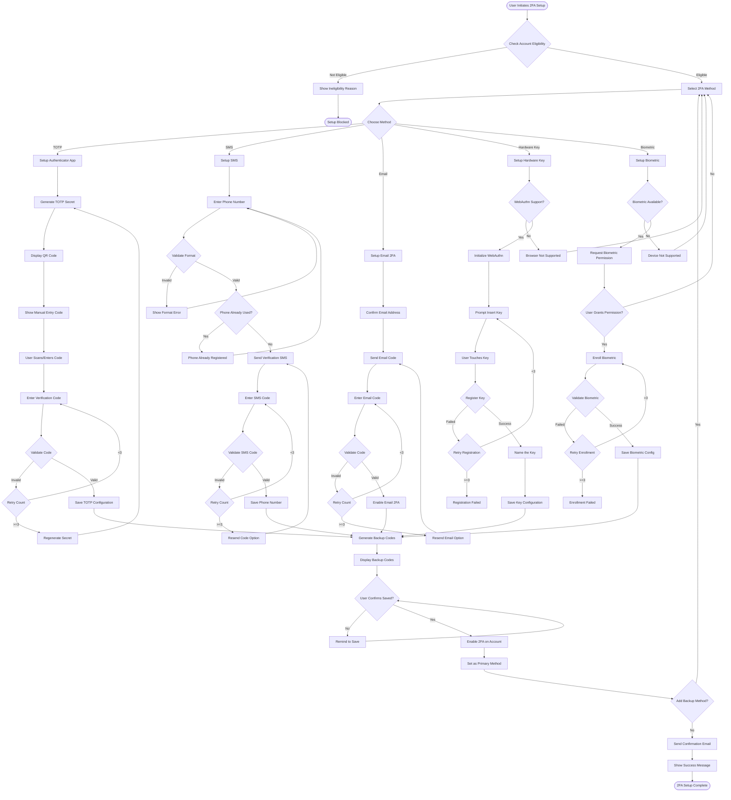
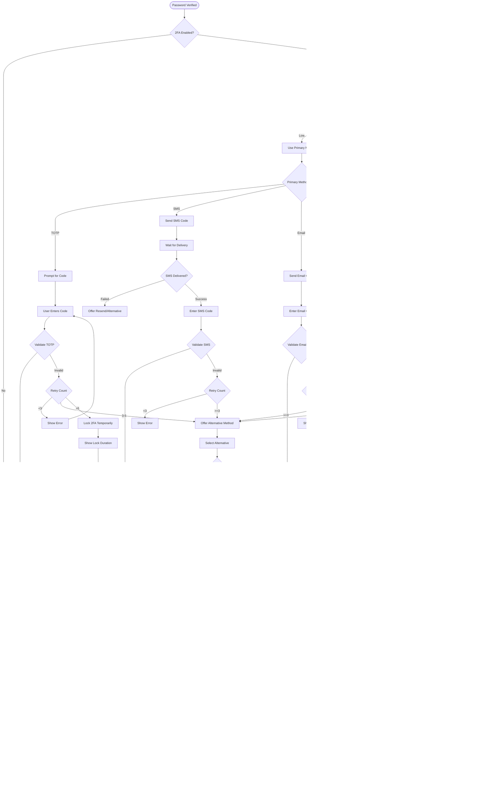

# Two-Factor Authentication (2FA) Business Flow

## Executive Summary
Two-factor authentication adds an essential security layer by requiring users to verify their identity through two independent factors: something they know (password) and something they have (device/phone). The system supports multiple 2FA methods with graceful fallbacks and recovery options.

## 2FA Setup and Management Flow



## 2FA Authentication Flow



## Detailed Business Logic

### 1. Eligibility Requirements

#### Account Eligibility
```
Minimum Requirements:
- Email verified: Required
- Account age: >24 hours
- Account status: Active
- No recent security incidents
- Minimum activity level

Restrictions:
- Suspended accounts: Blocked
- Unverified emails: Must verify first
- Recent password reset: 24h wait
- Multiple failed attempts: Temporary block

Special Cases:
- Enterprise accounts: Mandatory 2FA
- Admin accounts: Mandatory strong 2FA
- High-value accounts: Recommended 2FA
- Compromised accounts: Required after recovery
```

### 2. TOTP Implementation

#### Secret Generation
```
TOTP Configuration:
Algorithm: HMAC-SHA1 (default) or SHA256
Digits: 6 (standard) or 8 (high security)
Period: 30 seconds
Window: ±1 period tolerance
Secret: 32 bytes (Base32 encoded)

QR Code Format:
otpauth://totp/StitchAndWear:user@email.com
?secret=BASE32SECRET
&issuer=StitchAndWear
&algorithm=SHA1
&digits=6
&period=30

Storage:
{
  user_id: UUID,
  secret_encrypted: AES256(secret),
  algorithm: 'SHA1',
  digits: 6,
  period: 30,
  backup_codes: ENCRYPTED_JSON,
  created_at: TIMESTAMP,
  last_used: TIMESTAMP,
  counter: INTEGER (for HOTP)
}
```

#### Validation Logic
```
Code Validation:
1. Get current timestamp
2. Calculate time counter: floor(time / 30)
3. Generate codes for counter -1, 0, +1
4. Compare with user input (constant time)
5. Prevent replay within same window
6. Update last_used timestamp

Anti-Replay:
- Store last successful counter
- Reject if counter <= last_used
- Clear after time window passes
- Rate limit validation attempts
```

### 3. SMS 2FA

#### Phone Number Management
```
Phone Validation:
- E.164 format required
- Validate against libphonenumber
- Check carrier type (mobile only)
- Block VOIP numbers (optional)
- Verify country code allowed

Storage:
{
  user_id: UUID,
  phone_number: E.164 format,
  phone_hash: SHA256(phone),
  verified: BOOLEAN,
  carrier: TEXT,
  country_code: TEXT,
  last_code_sent: TIMESTAMP,
  send_count: INTEGER,
  blocked_until: TIMESTAMP
}

Rate Limiting:
- 1 code per minute
- 3 codes per hour
- 10 codes per day
- Progressive backoff on failures
```

#### SMS Delivery
```
Code Generation:
- Length: 6 digits
- Format: 000-000 (display)
- Validity: 10 minutes
- Cryptographically secure random

Message Template:
"Your Stitch & Wear code is: {code}
Valid for 10 minutes.
Never share this code."

Delivery Strategy:
Primary: Twilio SMS
Fallback 1: Secondary SMS provider
Fallback 2: Voice call
Fallback 3: Email code

Cost Management:
- Track cost per SMS
- Geographic pricing tiers
- Budget alerts
- Fraud detection
```

### 4. Email 2FA

#### Email Code System
```
Code Properties:
- Length: 6-8 characters
- Type: Alphanumeric (case-insensitive)
- Validity: 15 minutes
- Single use enforcement

Email Template:
Subject: "Your Stitch & Wear Security Code"
Body:
- Personalized greeting
- Security code prominently displayed
- Validity duration
- Warning about sharing
- Not you? Contact support

Delivery Assurance:
- High priority flag
- Read receipts (if supported)
- Click tracking
- Bounce handling
```

### 5. Hardware Key (FIDO2/WebAuthn)

#### WebAuthn Implementation
```
Registration Flow:
1. Generate challenge (32 bytes random)
2. Set relying party info
3. Configure authenticator selection
4. User performs gesture (touch/PIN)
5. Receive attestation response
6. Verify attestation
7. Store credential

Credential Storage:
{
  credential_id: Base64,
  public_key: Base64,
  counter: INTEGER,
  aaguid: UUID,
  attestation_format: TEXT,
  user_handle: UUID,
  device_name: TEXT,
  last_used: TIMESTAMP
}

Authentication:
1. Generate challenge
2. Request assertion
3. User performs gesture
4. Verify signature
5. Check counter increment
6. Update last_used
```

#### Key Management
```
Multiple Keys:
- Support multiple keys per user
- Require names for identification
- Show last used timestamp
- Allow revocation individually

Backup Requirements:
- Recommend 2+ keys
- Enforce for high-value accounts
- Provide backup codes
- Support key recovery
```

### 6. Biometric Authentication

#### Mobile Biometric
```
Supported Types:
iOS:
- Face ID
- Touch ID
- Device passcode fallback

Android:
- Fingerprint
- Face recognition
- Iris scanning
- Device PIN/pattern fallback

Implementation:
- Use platform APIs (BiometricPrompt)
- Store public key only
- Challenge-response authentication
- Require recent enrollment
```

#### Security Requirements
```
Biometric Security:
- Class 3 biometric required (Android)
- Liveness detection preferred
- Fallback mandatory
- Re-enrollment on changes
- Timeout after failures

Privacy:
- No biometric data stored
- Only cryptographic keys
- Local device processing
- User consent required
```

### 7. Backup Codes

#### Code Generation
```
Backup Code Properties:
- Count: 10 codes generated
- Format: XXXX-XXXX-XXXX
- Characters: Alphanumeric (no ambiguous)
- Single use only
- No expiration

Generation:
1. Generate cryptographically secure random
2. Format for readability
3. Hash for storage (bcrypt)
4. Encrypt for backup
5. Show download/print option

Storage:
{
  code_hash: BCRYPT_HASH,
  used_at: TIMESTAMP (nullable),
  used_ip: INET (nullable),
  created_at: TIMESTAMP
}
```

#### Recovery Flow
```
Using Backup Codes:
1. Select "Use backup code"
2. Enter code (ignore formatting)
3. Validate against hashes
4. Mark as used
5. Show remaining count
6. Suggest regeneration if low

Post-Use:
- Cannot reuse code
- Log security event
- Send notification
- Prompt 2FA reconfiguration
- Generate new codes if <3 remaining
```

### 8. Risk-Based Authentication

#### Risk Factors
```
Risk Calculation:
Device Trust:
- Known device: 0 points
- New device: +20 points
- Suspicious fingerprint: +30 points

Location:
- Usual location: 0 points
- New city: +15 points
- New country: +30 points
- Impossible travel: +50 points

Behavior:
- Normal time: 0 points
- Unusual hour: +10 points
- Rapid attempts: +20 points
- After security event: +40 points

Method Strength:
- FIDO2: Low risk tolerance
- TOTP: Medium risk tolerance
- SMS: High risk tolerance
- Email: Highest risk tolerance
```

#### Adaptive Requirements
```
Low Risk (0-20):
- Any configured method
- Trust device option available
- Standard session duration

Medium Risk (21-50):
- Stronger method required
- No device trust option
- Reduced session duration
- Activity monitoring

High Risk (51+):
- Multiple methods required
- No trust options
- Short session (1 hour)
- Real-time monitoring
- Admin notification
```

### 9. Device Trust

#### Trust Establishment
```
Trust Criteria:
- Successful 2FA verification
- Low risk score
- User explicitly chooses
- Device not compromised
- Account in good standing

Trust Levels:
1. Session only (default)
2. 7 days (medium trust)
3. 30 days (high trust)
4. Until revoked (managed devices)

Trust Token:
- Secure cookie (httpOnly, secure)
- Device fingerprint bound
- Encrypted payload
- Signed with HMAC
- Rotation on use
```

#### Trust Revocation
```
Revocation Triggers:
- User manual revoke
- Password change
- Security incident
- Suspicious activity
- Device compromise
- Timeout expiry

Revocation Process:
1. Clear trust tokens
2. Invalidate sessions
3. Send notification
4. Log security event
5. Require full authentication
```

### 10. Support and Recovery

#### Lost Access Recovery
```
Recovery Options:
1. Backup codes (primary)
2. Alternative 2FA method
3. Email recovery flow
4. Support verification

Support Verification:
- Ticket reference number
- Identity verification
- Account history questions
- Transaction verification
- Video call (high-value)

Recovery Process:
1. Disable current 2FA
2. Verify identity thoroughly
3. Issue temporary access
4. Force 2FA reconfiguration
5. Generate new backup codes
6. Security review
```

## Analytics and Monitoring

### Usage Metrics
```
Adoption Metrics:
- 2FA enrollment rate
- Method preference distribution
- Setup completion rate
- Recovery usage rate

Security Metrics:
- Failed verification rate
- Attack detection rate
- Bypass usage rate
- Support ticket rate

Performance Metrics:
- SMS delivery time
- Code generation time
- Validation latency
- Method reliability
```

### Security Monitoring
```
Alert Triggers:
- Multiple failed attempts
- Unusual geographic patterns
- Bypass code usage spike
- Method downgrade attempts
- Coordinated attacks

Response Actions:
- Automatic lockdown
- Admin notification
- User warning
- Rate limit enforcement
- Method restriction
```

## Error Messages

### User-Facing Messages
```
Setup Errors:
"This phone number is already registered to another account"
"Invalid authenticator code. Please check your app's time settings"
"Browser doesn't support security keys. Please try Chrome, Firefox, or Edge"
"Biometric authentication not available on this device"

Verification Errors:
"Invalid code. Please try again ({remaining} attempts left)"
"This backup code has already been used"
"Security key not recognized. Please try another key"
"Too many attempts. Please try again in {time}"

Recovery Messages:
"Can't access your device? Use a backup code or contact support"
"All methods failed? Click here for account recovery options"
"2FA has been temporarily locked for security. Try again in 1 hour"
```

## Compliance Requirements

### Regulatory Compliance
- PSD2 SCA (EU): Strong customer authentication
- NIST 800-63B: Authentication guidelines
- FIDO Alliance: Certification requirements
- Accessibility: WCAG 2.1 AA compliance

### Industry Standards
- OATH TOTP/HOTP specifications
- WebAuthn W3C standard
- SMS delivery best practices
- Biometric privacy regulations