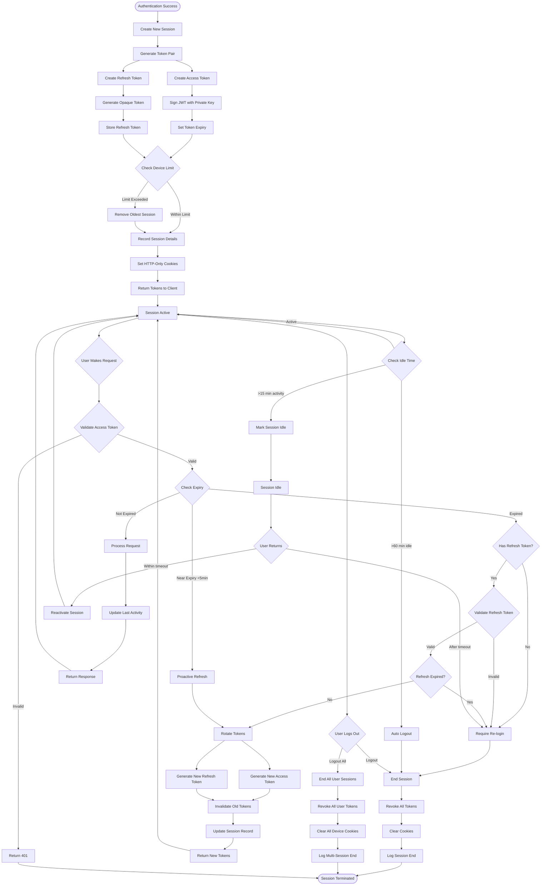

# Session Management Business Logic

## Executive Summary
Session management orchestrates the lifecycle of user sessions from creation through termination, handling token rotation, concurrent sessions, security monitoring, and cross-device synchronization. The system implements JWT-based authentication with refresh token rotation and comprehensive session security.

## Session Lifecycle Flow



## Detailed Business Logic

### 1. Session Creation

#### Token Generation
```
Access Token (JWT):
Header:
{
  "alg": "RS256",
  "typ": "JWT",
  "kid": "key-id-2024-01"
}

Payload:
{
  "sub": "user-uuid",
  "iat": 1704067200,
  "exp": 1704068100, // 15 minutes
  "jti": "session-uuid",
  "role": "client|tailor|admin",
  "permissions": ["read", "write"],
  "device_id": "device-fingerprint",
  "session_id": "session-uuid",
  "risk_score": 25,
  "mfa_verified": true
}

Signature:
RS256(base64UrlEncode(header) + "." + base64UrlEncode(payload), privateKey)

Refresh Token:
- Format: Opaque 32-byte random string
- Storage: Database with hash
- Lifetime: 7 days (default) or 30 days (remember me)
- Rotation: New token on each use
```

#### Session Storage Schema
```
sessions {
  session_id: UUID PRIMARY KEY,
  user_id: UUID NOT NULL,
  refresh_token_hash: VARCHAR(64),
  device_id: VARCHAR(128),
  device_fingerprint: TEXT,
  ip_address: INET,
  user_agent: TEXT,
  created_at: TIMESTAMP,
  last_activity: TIMESTAMP,
  expires_at: TIMESTAMP,
  idle_since: TIMESTAMP,
  risk_score: INTEGER,
  mfa_completed: BOOLEAN,
  trust_level: ENUM('none','session','persistent'),
  metadata: JSONB
}

session_events {
  event_id: UUID PRIMARY KEY,
  session_id: UUID,
  event_type: VARCHAR(50),
  timestamp: TIMESTAMP,
  ip_address: INET,
  details: JSONB
}
```

### 2. Token Management

#### Access Token Lifecycle
```
Token States:
ACTIVE: Valid and not expired
EXPIRING: <5 minutes remaining
EXPIRED: Past expiration time
REVOKED: Manually invalidated
REPLACED: Rotated to new token

Validation Process:
1. Parse JWT header and payload
2. Verify signature with public key
3. Check token not in blacklist
4. Verify expiration time
5. Validate issuer and audience
6. Check session still active
7. Verify device fingerprint match
8. Check user account status

Clock Skew Tolerance:
- Allow ±30 seconds for time sync issues
- Reject if outside tolerance window
- Log clock skew warnings
```

#### Refresh Token Rotation
```
Rotation Strategy:
1. Validate current refresh token
2. Check token not already used
3. Generate new token pair
4. Invalidate old tokens
5. Update session record
6. Set grace period (30 seconds)
7. Return new tokens

Grace Period:
- Allow old token for 30 seconds
- Prevents race conditions
- Log concurrent usage
- Investigate suspicious patterns

Reuse Detection:
If refresh token reused:
1. Assume token theft
2. Revoke entire token family
3. Terminate all sessions
4. Notify user immediately
5. Force re-authentication
```

### 3. Concurrent Sessions

#### Multi-Device Management
```
Session Limits:
- Default: 5 concurrent sessions
- Mobile apps: 3 devices
- Web browsers: 5 sessions
- Admin accounts: 2 sessions
- Configurable per user tier

Device Recognition:
{
  device_id: Generated UUID,
  device_name: "Chrome on MacOS",
  device_type: "browser|mobile|tablet|desktop",
  fingerprint: {
    user_agent: String,
    screen_resolution: String,
    timezone: String,
    language: String,
    platform: String,
    canvas_hash: String
  },
  trusted: Boolean,
  last_seen: Timestamp
}

Limit Enforcement:
When limit exceeded:
1. Show active sessions list
2. Allow user to choose removal
3. Or auto-remove oldest inactive
4. Log device management event
5. Send notification to removed device
```

#### Cross-Device Sync
```
Sync Events:
- Password change: Revoke all sessions
- Security update: Force re-authentication
- Permission change: Update all tokens
- Account lock: Terminate immediately
- 2FA change: Require reverification

Real-time Updates:
- WebSocket for active sessions
- Push notifications for mobile
- Polling fallback for inactive
- Event queue for offline devices
```

### 4. Session Security

#### Idle Management
```
Idle Timeout Configuration:
Activity Timeout: 15 minutes (no requests)
Absolute Timeout: 8 hours (maximum session)
Idle Warning: Show at 13 minutes
Auto-save: Before timeout

Idle States:
ACTIVE: Recent activity (<15 min)
WARNING: Near timeout (13-15 min)
IDLE: No activity (15-60 min)
EXPIRED: Terminated (>60 min)

Keep-Alive:
- Client heartbeat every 5 minutes
- Reset idle timer on activity
- Background tabs reduced frequency
- Mobile apps background refresh
```

#### Session Hijacking Prevention
```
Security Measures:
1. IP Address Validation:
   - Warn on IP change
   - Block on country change
   - Allow VPN with notification

2. Device Fingerprint:
   - Monitor for changes
   - Score deviation level
   - Challenge if high change

3. Behavioral Analysis:
   - Request patterns
   - Access velocity
   - Resource usage
   - Geographic impossibility

4. Token Binding:
   - Bind to TLS session
   - Certificate pinning
   - Mutual TLS for high security
```

### 5. Cookie Management

#### Cookie Configuration
```
Access Token Cookie:
Name: sat_access
Value: JWT token
HttpOnly: true
Secure: true (HTTPS only)
SameSite: Strict
Path: /
Max-Age: 900 (15 minutes)
Domain: .stitchandwear.com

Refresh Token Cookie:
Name: sat_refresh  
Value: Opaque token
HttpOnly: true
Secure: true
SameSite: Strict
Path: /auth/refresh
Max-Age: 604800 (7 days)
Domain: .stitchandwear.com

Device ID Cookie:
Name: sat_device
Value: Device UUID
HttpOnly: true
Secure: true
SameSite: Strict
Path: /
Max-Age: 31536000 (1 year)
Domain: .stitchandwear.com
```

#### CSRF Protection
```
CSRF Token:
- Generated per session
- Rotated on sensitive operations
- Double submit cookie pattern
- Synchronized token pattern for forms
- SameSite cookie attribute

Validation:
1. Check Origin header
2. Verify Referer header
3. Validate CSRF token
4. Check SameSite cookie
5. Log validation failures
```

### 6. Token Refresh Strategy

#### Proactive Refresh
```
Refresh Triggers:
- 5 minutes before expiry
- On sensitive operations
- After idle reactivation
- On permission changes

Client Implementation:
1. Monitor token expiry
2. Set refresh timer
3. Refresh in background
4. Update stored tokens
5. Retry failed requests
6. Handle refresh failures

Silent Refresh:
- Hidden iframe for web
- Background service for mobile
- No user interruption
- Automatic retry logic
```

#### Refresh Failure Handling
```
Failure Scenarios:
1. Network Error:
   - Retry with exponential backoff
   - Queue requests during offline
   - Sync when connection restored

2. Token Invalid:
   - Clear all tokens
   - Redirect to login
   - Preserve return URL
   - Show session expired message

3. Account Issue:
   - Check account status
   - Show specific error
   - Provide recovery options
   - Contact support link
```

### 7. Session Termination

#### Logout Types
```
Single Logout:
1. Revoke current session tokens
2. Clear session cookies
3. Remove from active sessions
4. Log logout event
5. Redirect to login page

Global Logout:
1. Revoke all user sessions
2. Clear all device cookies
3. Invalidate all refresh tokens
4. Send notifications to devices
5. Force re-authentication everywhere

Selective Logout:
1. Show sessions list
2. Allow selection
3. Revoke selected sessions
4. Notify affected devices
5. Log admin action
```

#### Forced Termination
```
Termination Triggers:
- Security breach detected
- Account compromise
- Terms violation
- Payment failure (premium)
- Admin action

Termination Process:
1. Immediate token revocation
2. WebSocket disconnect
3. Database session deletion
4. Cache invalidation
5. Audit log entry
6. User notification
7. Support ticket creation
```

### 8. Session Monitoring

#### Activity Tracking
```
Tracked Events:
{
  session_id: UUID,
  timestamp: ISO8601,
  event_type: "login|refresh|activity|logout",
  ip_address: "192.168.1.1",
  user_agent: "Mozilla/5.0...",
  endpoint: "/api/resource",
  method: "GET|POST|PUT|DELETE",
  response_code: 200,
  response_time_ms: 145,
  risk_indicators: []
}

Aggregated Metrics:
- Request count per session
- Average response time
- Error rate
- Geographic distribution
- Device type breakdown
- Peak usage times
```

#### Anomaly Detection
```
Suspicious Patterns:
- Rapid token refresh (>10/min)
- Multiple geographic locations
- Unusual access patterns
- High error rates
- Permission escalation attempts
- Concurrent token usage

Response Actions:
Low Risk: Log and monitor
Medium Risk: Additional verification
High Risk: Session suspension
Critical Risk: Immediate termination
```

### 9. Performance Optimization

#### Token Caching
```
Cache Strategy:
- Redis for active sessions
- 15-minute TTL for access tokens
- Lazy deletion on expiry
- Warm cache on login

Cache Structure:
KEY: session:{session_id}
VALUE: {
  user_id: UUID,
  permissions: [],
  expires_at: timestamp,
  device_id: string,
  risk_score: integer
}

Cache Invalidation:
- On token rotation
- On permission changes
- On security events
- On explicit logout
```

#### Load Balancing
```
Session Affinity:
- Sticky sessions not required
- Stateless JWT validation
- Centralized session store
- Distributed cache layer

Scaling Strategy:
- Horizontal scaling for API servers
- Read replicas for session queries
- Write primary for updates
- Cache layer for performance
```

### 10. Compliance & Audit

#### Session Audit Log
```
Required Logging:
- All authentication events
- Token generation/rotation
- Session creation/termination
- Failed validation attempts
- Security interventions
- Administrative actions

Log Retention:
- Active sessions: Real-time
- Completed sessions: 90 days
- Security events: 1 year
- Compliance logs: 7 years

Log Format:
{
  timestamp: ISO8601,
  session_id: UUID,
  user_id: UUID,
  event_type: String,
  ip_address: String,
  user_agent: String,
  success: Boolean,
  details: {
    // Event-specific data
  }
}
```

#### Privacy Compliance
```
GDPR Requirements:
- Right to access session data
- Session data portability
- Deletion on request
- Consent for tracking
- Data minimization

Cookie Consent:
- Essential cookies exempt
- Analytics require consent
- Marketing require explicit consent
- Consent management platform
- Cookie policy updates
```

## Session Recovery

### Emergency Access
```
Recovery Scenarios:
1. Lost Device:
   - Email verification
   - Security questions
   - Support verification
   - New device registration

2. Token Corruption:
   - Clear local storage
   - Force new session
   - Preserve user context
   - Automatic recovery

3. Mass Invalidation:
   - Security incident response
   - Gradual re-authentication
   - Priority user handling
   - Communication plan
```

## Performance Metrics

### Target Metrics
```
Performance Goals:
- Session creation: <500ms
- Token validation: <50ms
- Token refresh: <200ms
- Session lookup: <100ms
- Logout: <300ms

Availability:
- 99.99% uptime
- <1s recovery time
- Zero data loss
- Graceful degradation

Scale:
- 1M concurrent sessions
- 10K logins/second
- 100K refresh/second
- 1B validations/day
```

## Error Handling

### Client Error Messages
```
Session Errors:
"Your session has expired. Please log in again."
"This device is not recognized. Please verify your identity."
"Too many active sessions. Please close other devices."
"Session terminated for security. Please contact support."
"Unable to refresh session. Check your connection."

Recovery Messages:
"Click here to log in again and continue where you left off."
"Your work has been saved. You can resume after logging in."
"For security, please verify this new device."
```